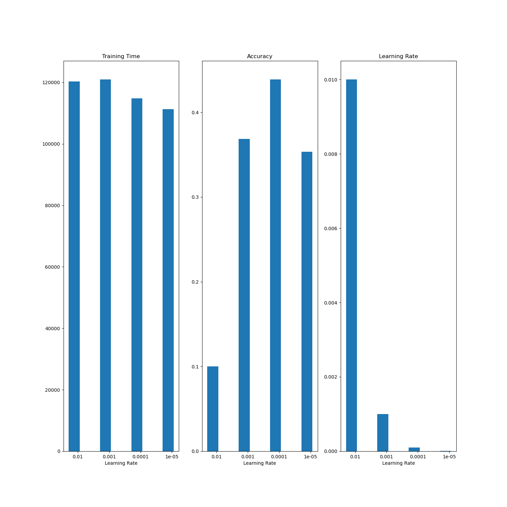

## Tasks and Questions

Tasks
- Try 3 different learning rate values and observe how this changes the training curves, training time and results on the test data.
- Try different architectures for your MLP. For example, you can increase the number of layers or use a different activation function (e.g. Sigmoid) and compare them on the test dataset.

Question:
- Which of the models you have trained in this and in the previous notebook perform best?
- Besides the final performance, how do the training curves differ?
- Can you find any systematic similarities or differences in the confusion matrix for the different models?
- What can you do to make the results of these comparisons more reliable?

Advanced:
- Try one or more of your architectures with preset filters (see last notebook) as input features.

# Answers

## Task 1
- In this case I trained models with four different learning rates, properly `1.e-2, 1.e-3, 1.e-4 and 1.e-5`. The results in accuracy and training time relative to the learning rate can be viewed here.

## Task 2

For this tasks I used the `LogSigmoid`, `LogSoftmax` `Sigmoid` and `ReLU` activation functions. The accuracies were 10%, 10%, 10% and 43% respectively. 

## Questions
- The MLP with the LogSoftmax activation function an layers just like the example MLP performed about 20% better on average than the other models with LogSigmoid, LogSoftmax and extra layers.

- The loss of the original MLP started at about 2 and by the fourth epoch it had reached 1.75.
- The loss of the LogSigmoid MLP simply stagnated at 0 during the entire training. I think this happens because the input values were much smaller than one, making the logistic sigmoid function converge against zero since the first epoch
- The model with extra layers performed a bit better than the original MLP. Loss started at 1.75 and ended by almost 1.5. But still the accuracy of the model was much lower than the original MLP, and the training was almost ten times longer than the original model.

## Advanced task
- Training the original MLP with ReLU layers using `random_flip` and `random_color_jitter` filters with 4 epochs yielded an accuraccy of 47% on the cifar dataset.
